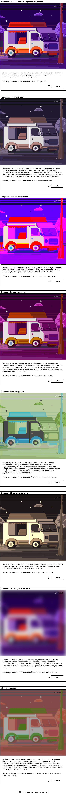

[https://github.com/Witcher26/zakrivayuschiy-teg-f](https://witcher26.github.io/zakrivayuschiy-teg-f/)

> Минималистичный одностраничник, который помогает остановиться, подумать и записать свои мысли на пути изучения вёрстки и фронтенда.
> Адаптивный дизайн, вдохновляющий на концентрацию и размышления о процессе обучения.

> ## 💡 О чём этот сайт?

Сайт — это **место остановки и размышлений**.
Он позволяет:

- Отметить, где вы сейчас на пути обучения;
- Задуматься о своих эмоциях, страхах и успехах;
- Вспомнить, как проходили первые спринты и задания;
- Сохранить свои мысли и воспоминания.

> _«Путь — это результат сам по себе».

